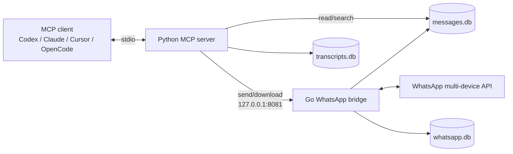

# WhatsApp MCP Server — maintained fork

Connect an MCP-compatible AI client to your personal WhatsApp account. Search chats and contacts, read message history, send messages and files, download media, and transcribe voice notes while keeping the bridge and its databases on your machine.

> [!IMPORTANT]
> This is a maintained fork of [lharries/whatsapp-mcp](https://github.com/lharries/whatsapp-mcp). The upstream public `main` branch last changed on July 13, 2025; this fork continues the project with compatibility fixes, a persistent Windows installer, richer media support, and voice-note transcription.

> [!NOTE]
> **Development transparency:** the fork-specific fixes and features were vibe-coded: implemented with substantial AI assistance, iterated against real failures, supported by regression tests, and used in the maintainer's working installation. This is community software, so review the code and security notes before connecting an important account.


## What this fork adds

- **Current WhatsApp compatibility:** an updated [`whatsmeow`](https://github.com/tulir/whatsmeow) dependency avoids the `405 Client outdated` failure seen with the old pin.
- **More reliable connections:** the bridge uses IPv4, HTTP/1.1, and a bounded TLS-handshake retry for networks and virtual machines that black-hole the first connection attempt.
- **Local-only bridge API:** the Go REST bridge listens on `127.0.0.1:8081`, not on every network interface.
- **Automated Windows setup:** one PowerShell script installs prerequisites, builds the bridge, prepares Python dependencies and the Whisper model, configures supported MCP clients, registers hidden supervised startup, and adds an uninstaller.
- **Persistent Windows operation:** the bridge starts after sign-in without a visible PowerShell window and restarts after a failure.
- **Usable incoming media:** messages include media metadata; media can be downloaded on demand and exposed to clients through tool results or an MCP resource.
- **Voice-note transcription:** `list_messages` can append transcripts automatically, while `transcribe_audio` supports explicit transcription through local `faster-whisper` or the OpenAI API.
- **Persistent transcript cache:** completed transcripts are reused across MCP calls and pruned with configurable age and size limits.
- **Broader client setup:** automated configuration for Codex, Claude Desktop, and OpenCode, plus manual instructions for Cursor and other stdio MCP clients.
- **Regression coverage:** tests protect the bridge port, automatic transcription, provider selection, transcript caching, and hidden Windows startup.

## Security and privacy

The bridge connects to your **personal WhatsApp account** through WhatsApp's web multi-device protocol using `whatsmeow`. It is not affiliated with or endorsed by WhatsApp or Meta.

- Chat metadata and message history are stored locally in SQLite under `whatsapp-bridge/store/`.
- Media bytes are downloaded only when requested. Transcripts are cached locally in `transcripts.db`.
- The MCP server sends data to the configured AI client when that client invokes a tool. The optional OpenAI transcription provider also uploads the selected audio to OpenAI.
- The local databases are sensitive and are not encrypted by this project. Protect your OS account and backups, and never commit `whatsapp-bridge/store/`.
- Do not expose port `8081` through port forwarding, a reverse proxy, or a public bind.
- Messages are untrusted input. A prompt-injection message could influence an agent that can read data or send messages, a form of the [lethal trifecta](https://simonwillison.net/2025/Jun/16/the-lethal-trifecta/). Review tool calls and grant only the access you need.
- WhatsApp can change its protocol or policies at any time. Use this unofficial integration at your own risk.

## How it works



- **Go bridge (`whatsapp-bridge/`)** authenticates with a QR code, receives and stores messages, sends messages and media, downloads incoming media, and exposes a loopback-only REST API.
- **Python MCP server (`whatsapp-mcp-server/`)** runs over stdio, reads the local message database for searches, calls the bridge for write/download operations, and exposes the MCP tools and media resource.

The bridge must be running whenever you use tools that send or download data. Search and history tools read the locally synchronized database.

## Quick start: Windows

The automated installer is the recommended path on Windows 10/11. It requires [`winget`](https://learn.microsoft.com/windows/package-manager/winget/) and a WhatsApp mobile device for the initial QR scan.

Open PowerShell:

```powershell
git clone https://github.com/SahajJain01/whatsapp-mcp.git
cd whatsapp-mcp
powershell -ExecutionPolicy Bypass -File .\setup.ps1
```

The installer is safe to run again and will:

1. Install Go, MSYS2/GCC, `uv`, and FFmpeg when missing.
2. Copy the app to `%USERPROFILE%\mcp\whatsapp-mcp` without overwriting the local message store.
3. Enable CGO and build `whatsapp-bridge.exe`.
4. Run `uv sync` and download the default `faster-whisper` `large-v3` model.
5. Open the bridge once for WhatsApp's QR-code authentication.
6. Register the hidden, supervised `WhatsAppMCPBridge` scheduled task at sign-in.
7. Offer to configure Codex, Claude Desktop, OpenCode, any combination of them, or none.
8. Register WhatsApp MCP in Windows Installed apps with an uninstaller.

To choose clients without the interactive prompt:

```powershell
powershell -ExecutionPolicy Bypass -File .\setup.ps1 -McpClients Codex,ClaudeDesktop,OpenCode
```

To postpone the large local model download:

```powershell
powershell -ExecutionPolicy Bypass -File .\setup.ps1 -SkipModelDownload
```

Restart every client configured by the installer, then try:

> Search my WhatsApp contacts.

### Manage the Windows installation

Run these commands in PowerShell:

```powershell
# Start the background bridge
Start-ScheduledTask -TaskName WhatsAppMCPBridge

# Stop it
Stop-ScheduledTask -TaskName WhatsAppMCPBridge
Get-Process whatsapp-bridge -ErrorAction SilentlyContinue | Stop-Process

# Disable or re-enable startup at sign-in
Disable-ScheduledTask -TaskName WhatsAppMCPBridge
Enable-ScheduledTask -TaskName WhatsAppMCPBridge

# Run visibly for logs and diagnostics
& "$env:USERPROFILE\mcp\whatsapp-mcp\whatsapp-bridge\run-bridge.ps1"
```

Uninstall from **Settings > Apps > Installed apps > WhatsApp MCP**, or run:

```powershell
& "$env:USERPROFILE\mcp\whatsapp-mcp\whatsapp-bridge\uninstall.ps1"
```

The uninstaller asks for explicit confirmation and then removes the installed copy, including its local WhatsApp data store. Back up `store/` first if you want to keep that data.

## Manual installation

Use this path on macOS/Linux or when you do not want the automated Windows service setup.

### Prerequisites

- [Go 1.25+](https://go.dev/doc/install)
- [Python 3.11+](https://www.python.org/downloads/) (or let `uv` download a compatible Python)
- [`uv`](https://docs.astral.sh/uv/getting-started/installation/)
- A C compiler with CGO support for SQLite:
  - Linux: GCC or Clang and the usual build tools
  - macOS: Xcode Command Line Tools
  - Windows: [MSYS2](https://www.msys2.org/) with `C:\msys64\ucrt64\bin` on `PATH`
- An MCP client that can launch a local stdio server
- FFmpeg only if you want `send_audio_message` to convert MP3/WAV/other formats into WhatsApp-compatible Ogg Opus voice messages. Local transcription uses PyAV and does not require system FFmpeg.

### 1. Clone this fork

```bash
git clone https://github.com/SahajJain01/whatsapp-mcp.git
cd whatsapp-mcp
```

### 2. Install the Python environment

```bash
uv sync --project whatsapp-mcp-server
```

The default install includes local `faster-whisper`. To enable OpenAI transcription too:

```bash
uv sync --project whatsapp-mcp-server --extra openai
```

### 3. Start the WhatsApp bridge

On macOS/Linux:

```bash
cd whatsapp-bridge
CGO_ENABLED=1 go run .
```

On Windows PowerShell after installing MSYS2/GCC:

```powershell
$env:PATH = "C:\msys64\ucrt64\bin;$env:PATH"
$env:CGO_ENABLED = "1"
Set-Location .\whatsapp-bridge
go run .
```

On first launch, open **WhatsApp > Settings > Linked devices > Link a device** on your phone and scan the terminal QR code. Leave the bridge running. A returning authenticated session reconnects without another QR scan.

### 4. Configure an MCP client

Resolve the absolute paths before configuring a client:

```bash
command -v uv
cd whatsapp-mcp-server && pwd
```

On Windows PowerShell, use `Get-Command uv` and `(Resolve-Path .\whatsapp-mcp-server).Path` instead.

#### Codex

```bash
codex mcp add whatsapp -- /absolute/path/to/uv --directory /absolute/path/to/whatsapp-mcp-server run main.py
```

The Windows installer runs the equivalent command automatically when Codex is selected.

#### Claude Desktop or Cursor

Merge this entry into the client's MCP configuration, replacing both absolute paths:

```json
{
  "mcpServers": {
    "whatsapp": {
      "command": "/absolute/path/to/uv",
      "args": [
        "--directory",
        "/absolute/path/to/whatsapp-mcp-server",
        "run",
        "main.py"
      ]
    }
  }
}
```

Common configuration locations:

- Claude Desktop on Windows: `%APPDATA%\Claude\claude_desktop_config.json`
- Claude Desktop on macOS: `~/Library/Application Support/Claude/claude_desktop_config.json`
- Cursor: `~/.cursor/mcp.json` or the project-level `.cursor/mcp.json`

#### OpenCode

Merge this entry into `~/.config/opencode/opencode.json` (Windows: `%USERPROFILE%\.config\opencode\opencode.json`):

```json
{
  "mcp": {
    "whatsapp": {
      "type": "local",
      "command": ["/absolute/path/to/uv", "run", "main.py"],
      "cwd": "/absolute/path/to/whatsapp-mcp-server",
      "enabled": true
    }
  }
}
```

Restart the client after changing its configuration. Most clients do not hot-reload MCP servers.

## MCP tools

| Tool | Purpose |
|---|---|
| `search_contacts` | Search contacts by name or phone number. |
| `list_messages` | List messages with chat, sender, date, and pagination filters; automatically append voice-note transcripts. |
| `list_chats` | List chats with metadata and optional filters. |
| `get_chat` | Get one chat by JID. |
| `get_direct_chat_by_contact` | Find the direct chat for a contact. |
| `get_contact_chats` | List chats involving a contact. |
| `get_last_interaction` | Return the most recent message involving a contact. |
| `get_message_context` | Return messages around a selected message. |
| `send_message` | Send text to a phone number or group JID. |
| `send_file` | Send an image, video, raw audio file, or document. |
| `send_audio_message` | Send an Ogg Opus voice message, converting other audio formats with FFmpeg. |
| `download_media` | Download media for a message and return metadata plus client-readable content when supported. |
| `transcribe_audio` | Transcribe a selected voice note/audio message with a local or OpenAI provider. |

Clients that support MCP resources can also read downloaded content through:

```text
whatsapp-media://{chat_jid}/{message_id}
```

### Media behavior

- Incoming images, video, audio, documents, and stickers are recorded as message metadata.
- `download_media` needs the `message_id` and `chat_jid` shown in message results. It downloads the bytes only when requested.
- `send_file` sends common image/video/audio/document formats.
- `send_audio_message` produces a WhatsApp-style voice message. Ogg Opus works directly; other formats require FFmpeg conversion.

## Voice-note transcription

`list_messages` automatically places a transcript below each audio/voice-note result. `transcribe_audio(message_id, chat_jid, language=None)` is available for explicit requests. Successful transcripts are cached locally, keyed by message, provider, model, and language hint.

### Providers

- **Local (default):** `faster-whisper`, model `large-v3`, CPU, `int8`. The first model download is large; Windows setup downloads it up front unless `-SkipModelDownload` is used.
- **OpenAI:** install the `openai` extra, set `WHATSAPP_MCP_TRANSCRIBE_PROVIDER=openai`, and provide `OPENAI_API_KEY`. Selected audio is sent to the configured OpenAI transcription model.

Set variables in the environment inherited by your MCP client, or in that client's supported MCP environment configuration.

| Variable | Default | Description |
|---|---:|---|
| `WHATSAPP_MCP_TRANSCRIBE_PROVIDER` | `local` | `local` or `openai` |
| `WHATSAPP_MCP_WHISPER_MODEL` | `large-v3` | Local faster-whisper model name |
| `WHATSAPP_MCP_WHISPER_DEVICE` | `cpu` | Common values: `cpu`, `cuda` |
| `WHATSAPP_MCP_WHISPER_COMPUTE_TYPE` | `int8` | Common values: `int8`, `float16`, `float32` |
| `WHATSAPP_MCP_OPENAI_MODEL` | `whisper-1` | OpenAI transcription model ID |
| `OPENAI_API_KEY` | unset | Required only for the OpenAI provider |
| `WHATSAPP_MCP_TRANSCRIPT_CACHE_DAYS` | `30` | Delete cache entries not accessed within this many days |
| `WHATSAPP_MCP_TRANSCRIPT_CACHE_MAX_ENTRIES` | `1000` | Retain the most recently used entries; `0` disables caching |

A missing or non-audio message returns a structured `success: false` result instead of terminating the MCP server.

## Local data

Runtime data lives under `whatsapp-bridge/store/`:

| File | Contents |
|---|---|
| `messages.db` | Synchronized chats, message text, timestamps, senders, and media metadata |
| `whatsapp.db` | WhatsApp linked-device session state |
| `transcripts.db` | Cached voice-note transcripts and cache metadata |

The Windows installer preserves this directory when updating the installed copy. The uninstaller removes it after explicit confirmation, so back it up first if you want to retain it.

Before forcing a fresh login, stop the bridge and back up `store/`. Removing only `whatsapp.db` discards the linked-device session and causes the next bridge launch to show a new QR code; retaining `messages.db` preserves the local message index.

## Troubleshooting

### Client shows no WhatsApp tools

- Restart the MCP client after editing its configuration.
- Use absolute paths for both `uv` and `whatsapp-mcp-server`.
- Ensure the MCP process starts with `whatsapp-mcp-server` as its working directory; the relative SQLite path depends on it.
- Run `uv --directory /absolute/path/to/whatsapp-mcp-server run main.py` from a terminal to expose startup errors. It waits on stdio when healthy.

### Bridge is unavailable or sends fail

- Confirm the Go bridge is running and listening only on `127.0.0.1:8081`.
- On automated Windows installs, run `Get-ScheduledTask -TaskName WhatsAppMCPBridge` and start it if needed.
- Run `run-bridge.ps1` visibly to inspect logs.
- A single TLS-handshake warning followed by a successful retry can occur on affected networks. Repeated failures indicate a real network problem.

### `go-sqlite3` says CGO is disabled

Install a C compiler, ensure it is on `PATH`, set `CGO_ENABLED=1`, and rebuild. Windows users should use the MSYS2 UCRT64 GCC installed by `setup.ps1`.

### QR code does not appear

An existing valid `whatsapp.db` reconnects silently. If you intentionally need a new linked-device session, follow the backup and reset instructions under [Local data](#local-data).

### Transcription is slow or fails

- The first local run may download and load the selected Whisper model. `large-v3` prioritizes accuracy over download size and startup time; choose a smaller model with `WHATSAPP_MCP_WHISPER_MODEL` if needed.
- For CUDA, install a compatible faster-whisper/CTranslate2 runtime and choose a supported compute type.
- For OpenAI, verify the `openai` extra is installed and `OPENAI_API_KEY` reaches the MCP process.
- System FFmpeg is unrelated to local transcription; it is needed only to convert non-Opus audio for `send_audio_message`.

## Development and verification

Install Python development dependencies:

```bash
uv sync --project whatsapp-mcp-server --group dev
```

Run the existing regression suites:

```bash
# Go bridge
cd whatsapp-bridge
go test ./...

# Python MCP server (from the repository root)
uv run --project whatsapp-mcp-server pytest
```

On Windows, also run the scheduled-task/startup regression:

```powershell
powershell -ExecutionPolicy Bypass -File .\tests\test-windows-startup.ps1
```

There is currently no Docker/Compose setup. Contributions that improve portability, tests, or documentation are welcome; please describe the environment and include reproducible verification steps.

## Project status and credits

This repository exists to keep the useful work in the original project available on current setups. It is actively used by the fork maintainer, but it remains an unofficial community integration and cannot promise compatibility with future WhatsApp changes.

The original project and foundation are by [Luke Harries and contributors](https://github.com/lharries/whatsapp-mcp). Fork-specific changes are maintained at [SahajJain01/whatsapp-mcp](https://github.com/SahajJain01/whatsapp-mcp).

Licensed under the [MIT License](./LICENSE). The original copyright and permission notice are preserved.
